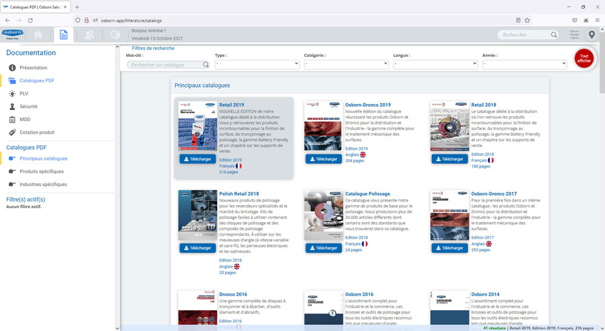
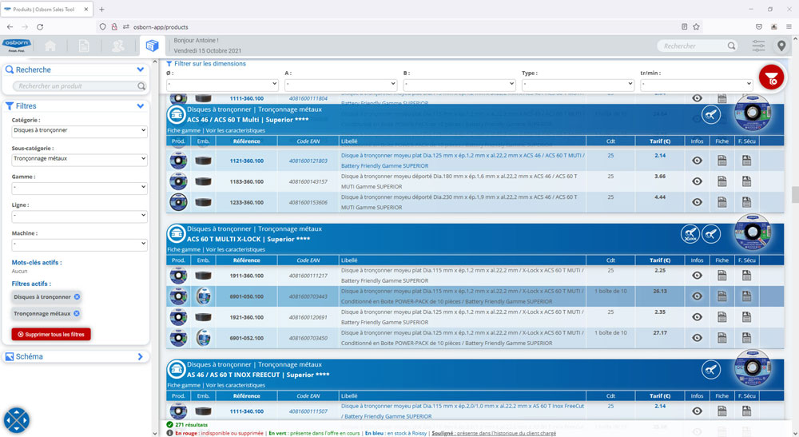

<!-- PROJECT LOGO -->
 

  

  <h3 align="center">Osborn Sales Tool</h3>

  

    An app that helps sales reps in their daily work with customers.
  

<!-- TABLE OF CONTENTS -->

  
Table of Contents

  <ul>
    <li>
      <a href="#about-the-project-">About The Project 👈</a>
      <ul>
        <li><a href="#context">Context</a></li>
        <li><a href="#objectives">Objectives</a></li>
        <li><a href="#our-solution">Our solution</a></li>
        <li><a href="#build-with">Build with</a></li>
      </ul>
    </li>
    <li>
      <a href="#brief-overview-">Brief overview 👀</a>
      <ul>
        <li><a href="#introduction">Introduction</a></li>
        <li><a href="#login-and-home">Login and home</a></li>
        <li><a href="#catalogs-and-products">Catalogs and products</a></li>
        <li><a href="#product">Product</a></li>
        <li><a href="#customer">Customer</a></li>
        <li><a href="#offer">Offer</a></li>
        <li><a href="#retail-store-layout">Retail store layout</a></li>
      </ul>
    </li>
    <li><a href="#contact-">Contact 📧</a></li>
  </ul>

<!-- ABOUT THE PROJECT -->

## About The Project 👈

### Context

**Field sales team used to work with very "old fashioned tools":**\
❌ No dynamic access to product data: we only had paper or PDF based catalogs\
❌ No dynamic access to customer data and history: sales prices evolution, product consumption, etc.\
❌ Fragmented data and necessisty to prepare everything manualy before visiting thez customer\
❌ Limited flexibility for in-meeting efficiency\
❌ Unexpected opportunities difficult to handler efficienty

**What about SAP?**\
✔️ Powerful but uneasy to handle: not user-friendly\
✔️ Very well made for ERP and financial planning and control\
❌ Fantastic for office based people BUT not for all field sales oriented\
❌ Very expensive licenses: no access to fiel sales guys\
❌ Everything must be prepared by the back-office before and managed with back-office afterwards

**Conclusion**\
👉 **We started to feel the `need for a modern tool to increase field sales efficiency.`**

### Objectives

🚀 **Improve field sales time to market & dynamic efficiency!**

We wanted to have a flexible and user-friendly IT tool providing:
- [ ] A complete catalog with all informations about each product
- [ ] A following-up of customer with sales historical data
- [ ] The creation and management of prices offers diretly at customer's premises
- [ ] The creation of retail store shelves layout with our products and relevant offer
- [ ] Secured, fast and dynamic access everywhere

### Our solution

We started to developp a flexible and user-friendly tool, based on what the people on the field wanted.

**We first developped an EXCEL based solution, but we faced:**\
👎 A lack of flexibility and maintainability 😱\
👎 Difficulties to adapt on differents devices and softwares versions 😬\
👎 Limited to computer (excluding smartphones and tablets 📵)

**Then we moved to a Web app**
- [x] Flexible, easy to maintain and to enhance
- [x] Accessible from every devices: 🖥️💻 computers, 📱 mobile devices
- [x] Access from everywhere with secure authentification
- [x] Dynamic access to data and modern field sales tool

### Build with

- **PHP** was used to build the application
- The interface is coded in **HTML** and styled in **CSS**
- Datas are hosted on a **MySQL** database
- **JavaScript** and the **JQuery** library ensure the dynamic interaction
- The whole app is currently localy hosted on Osborn French server

<!-- BRIEF OVERVIEW -->

## Brief overview 👀

### Introduction

- Brief overview of the new field team sales tool: **The app is pleasant and simple to use, complete.** It will really help our commercial team on the field to convince the client that Osborn is the best choice.
- Friendly and easy to use with explicit **graphic user interface**
- Developped and tested by the team on a localhost
- Tested on a remote serve (OVH) with dummy datas

### Login and home

|  |  | 
|---|---| 
| ***Login** With secured connection requiring login & password.* | ***Home** With last news (products, promotion, etc.).* |

### Catalogs and products

|  |  | 
|---|---| 
| ***PDF Catalogs** Here you can use filters to find the catalog you need, and download it.* | ***Products by category** All fields are clickable so you can display the products of each category.* |

### Product

|  |  | 
|---|---| 
| *When a category is selected, you have access to all the products in it...* | *... and then you can filter by the dimensions you want (diameter, thickness, material, etc.).* |
|  |  | 
| *For each product you can find the detailed information...* | *... and also information about the sales for this product.* |
|  |  | 
| *Product Specific product range of standard and on-demand possibilities.* | *Product data sheet giving all necessary information to the customer for a safe and efficient use.* |

### Customer

|  |  | 
|---|---| 
| *On the customer page, you can see all information (address, sales, offers you made for him).* | *You also have the list of all the items he ordered. Based on this, you can easily make a new price offers for the next year.* |

### Offer

|  |  | 
|---|---| 
| *Like on an merchant site, you can easily add products to you offer with special price or usual discount...* | *...and you can send to the custormer in PDF & Excel format.* |

### Retail store layout

|  |  | 
|---|---| 
| *You also can create a retail store layout with our product, with a fully functional page where you add, place and organize the products...* | *... and then get nice PDF presentation and the offer.* | 

<!-- CONTACT -->

## Contact 📧

Antoine Bollinger - [LinkedIn](https://www.linkedin.com/in/antoinebollinger/) - abollinger@osborn-unipol.fr
